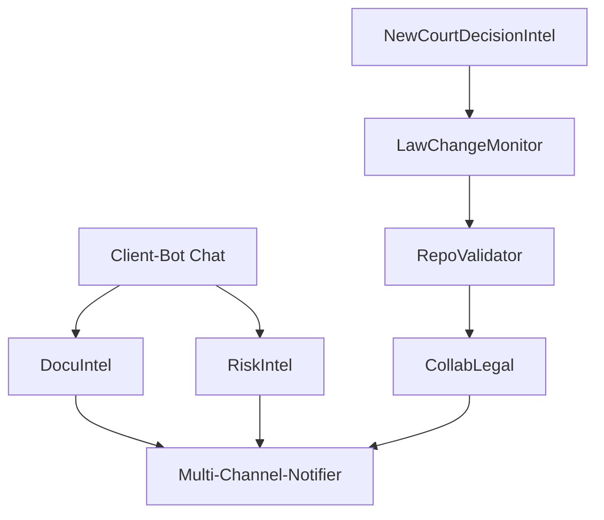

# xForCloBot Agent Architecture

## 🤖 Core Agents

### 1. DocuIntel Agent
**Purpose**: Legal Document Requirements Analysis
- Analyzes client-bot conversations
- Identifies required legal documents
- Generates document checklists
- Interfaces with document templates

### 2. RiskIntel Agent
**Purpose**: Foreclosure Risk Analysis
- Monitors case data for high-risk indicators
- Real-time risk scoring
- Alert generation for critical issues
- Risk mitigation recommendations

### 3. Multi-Channel-Notifier Agent
**Purpose**: Communication Distribution
- Case summary generation
- Multi-channel distribution (Email, Slack, Teams, WhatsApp, Signal, Discord)
- Template-based notifications
- Delivery confirmation tracking

### 4. NewCourtDecisionIntel Agent
**Purpose**: Court Decision Monitoring
- Web crawling for new decisions
- Relevance filtering
- Impact analysis
- Automatic repository updates

### 5. LawChangeMonitor Agent
**Purpose**: Legislative Updates
- Georgia law code monitoring
- Change detection
- Impact assessment
- Repository synchronization

### 6. RepoValidator Agent
**Purpose**: Data Accuracy Verification
- Case/law tracker validation
- Consistency checking
- Human validation workflows
- Automatic correction proposals

### 7. CollabLegal Agent
**Purpose**: Collaborative Case Analysis
- Multi-expert review coordination
- Consensus building
- Conflict resolution
- Decision documentation

## 🔄 Agent Interaction Flow

## 🛠️ Implementation Strategy

### Phase 1: Core Analysis
- DocuIntel Agent
- RiskIntel Agent
- Multi-Channel-Notifier Agent

### Phase 2: Monitoring
- NewCourtDecisionIntel Agent
- LawChangeMonitor Agent

### Phase 3: Validation & Collaboration
- RepoValidator Agent
- CollabLegal Agent

## 🔐 Security & Compliance

- End-to-end encryption for all communications
- Role-based access control
- Audit logging
- Data retention policies
- GDPR/CCPA compliance

## 📊 Performance Metrics

- Response time
- Accuracy rates
- Risk detection success
- Communication delivery rates
- Collaboration efficiency
- Update detection speed
